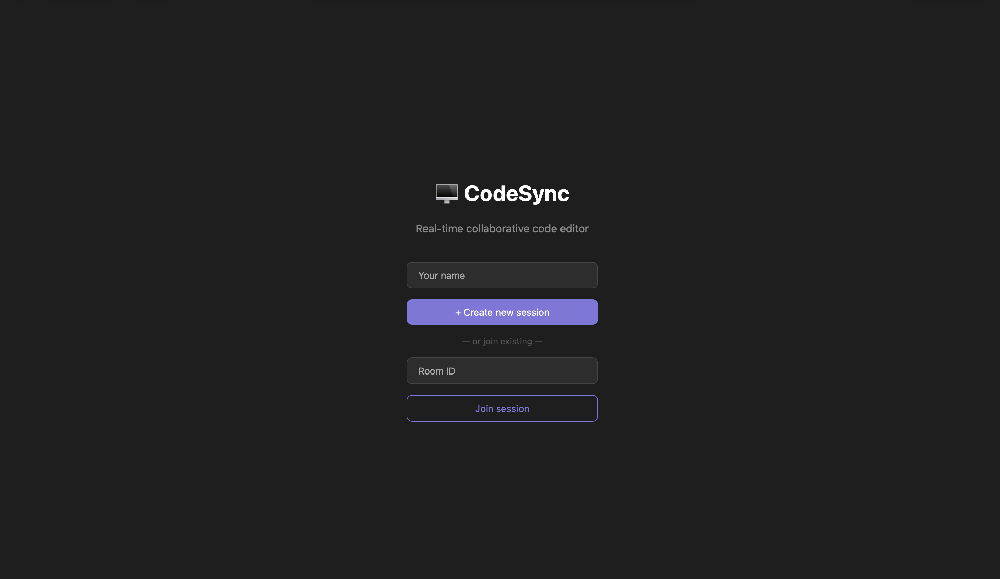
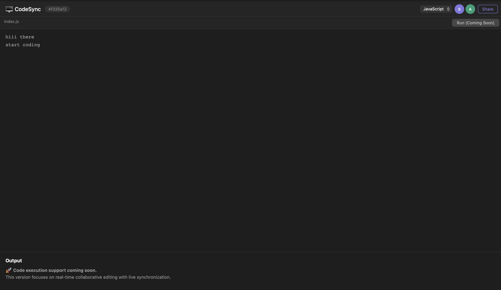
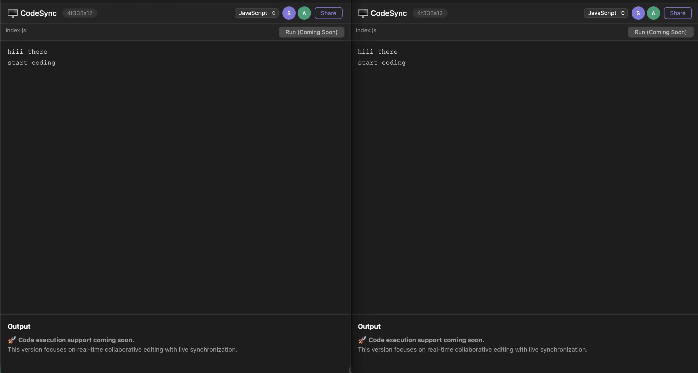

# 🖥️ CodeSync

CodeSync is a full-stack real-time collaborative code editor that enables multiple users to write and edit code simultaneously. Built with React, Node.js, Express, Socket.IO, and MongoDB, it provides instant code synchronization through shareable room IDs, making it suitable for pair programming, interview practice, collaborative learning, and team development.

## 🌐 Live Demo

🔗 https://collab-code-editor-cdl1.vercel.app/

---

## 📸 Preview

## Home Page



---

## Collaborative Editor



---

## Live Collaboration



---


## ✨ Features

- 🚀 Create unique coding sessions
- 👥 Join existing sessions using a Room ID
- ⚡ Real-time code synchronization
- 🔄 Multi-user collaboration
- 🎨 User avatars with unique colors
- 📋 One-click Room ID sharing
- 💾 Automatic session persistence using MongoDB
- 🌍 Fully deployed on Vercel + Render
- 📱 Responsive interface

---

## 🛠️ Tech Stack

### Frontend

- React
- Vite
- React Router
- Axios
- Socket.IO Client

### Backend

- Node.js
- Express.js
- Socket.IO
- MongoDB Atlas
- Mongoose

### Deployment

- Vercel
- Render

---


## 📂 Project Structure

```
Collab-Code-Editor
│
├── client/
│   ├── src/
│   ├── public/
│   └── package.json
│
├── server/
│   ├── routes/
│   ├── socket/
│   ├── models/
│   ├── db.js
│   └── package.json
│
├── screenshots/
│   ├── home.png
│   ├── editor.png
│   └── collaboration.png
│
└── README.md
```

---

## ⚙️ Installation

## Clone the repository

```bash
git clone https://github.com/14Sarthak/Collab-Code-Editor.git
```

### Backend

```bash
cd server
npm install
```

Create a `.env` file:

```env
MONGO_URI=YOUR_MONGODB_CONNECTION_STRING
PORT=8081
```

Run the backend:

```bash
npm start
```

---

### Frontend

```bash
cd client
npm install
```

Create `.env`

```env
VITE_API_URL=http://localhost:8081
VITE_SOCKET_URL=http://localhost:8081
```

Run:

```bash
npm run dev
```

---


## 🏗️ System Workflow
1. User creates a coding session.
2. Backend generates a unique Room ID.
3. Socket.IO connects all users in the room.
4. Every code update is broadcast instantly.
5. MongoDB stores the latest session state.
6. Users joining later receive the current code automatically.

---

## 🔮 Future Enhancements

- 🔹 Online code execution support
- 🔹 Syntax themes
- 🔹 Chat system
- 🔹 Voice collaboration
- 🔹 Cursor tracking
- 🔹 File explorer
- 🔹 Multiple files support
- 🔹 Authentication
- 🔹 Version history

---

# 📈 Project Highlights

- Real-time collaboration using WebSockets
- Full-stack MERN architecture
- Persistent coding sessions
- Production deployment
- Clean and responsive UI
- Scalable room-based architecture

---
